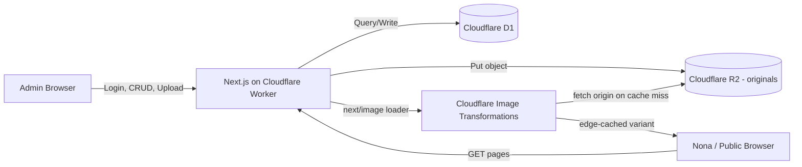

# ARCHITECTURE.md — Untukmu (Untuk Nona)

Status: SPECIFICATION — belum diimplementasikan. Dokumen ini mendefinisikan target architecture pasca-migrasi Cloudflare. Untuk arsitektur saat ini (baseline), lihat bagian 1.

Source of truth untuk requirement bisnis, content model, dan unlock logic tetap dokumentasi repository (`README.md`, `docs/design.md` v1, `supabase/schema.sql`). PDF "UNTUKMU Design Vision & Redesign Blueprint" hanya referensi visual/UX (lihat DESIGN.md).

---

## 1. Architectural style

**Modular Monolith** — satu aplikasi Next.js App Router yang menangani public experience dan admin CMS, di-deploy sebagai satu Cloudflare Worker. Tidak ada pemisahan service terpisah; kompleksitas domain (kenangan, surat, kartu, quiz, rencana, pengaturan situs) tidak cukup besar untuk justifikasi arsitektur service-oriented atau event-driven.

Ini tidak berubah dari gaya arsitektur sekarang (Next.js monolith di Vercel) — yang berubah adalah *runtime* dan *layer data/media*, bukan gaya arsitekturnya.

---

## 2. System boundaries

**Dalam scope sistem ini:**
- Public experience (landing, countdown, chapter journey, locked page)
- Admin CMS (login, CRUD konten, upload media, preview, health check)
- Unlock logic (client-side time check terhadap `NEXT_PUBLIC_UNLOCK_ISO`)
- Media pipeline (upload, storage, transformasi/delivery gambar)
- Sesi admin (autentikasi password tunggal, bukan multi-user)

**Di luar scope:**
- Sistem akun/registrasi untuk penerima (Nona tidak login — akses publik langsung setelah unlock)
- Multi-tenant atau multi-admin
- Notifikasi push/email
- Analytics pihak ketiga (tidak dibahas di PDF maupun dokumentasi repo — TBD jika diminta terpisah)

---

## 3. Baseline architecture (sebelum migrasi)

| Layer | Teknologi sekarang |
|---|---|
| Runtime/hosting | Vercel (Next.js standalone Node runtime) |
| Database | Supabase (Postgres), akses via `@supabase/supabase-js` dengan service role key |
| Media storage & transform | Cloudinary (upload API + `f_auto,q_auto,w_` URL transform) |
| Admin session | Cookie HMAC-signed pakai modul `crypto` Node.js (`lib/adminAuth.ts`) |
| Deployment source | GitHub → Vercel (asumsi; `docs/DEPLOY_VERCEL.md` ada di repo) |

---

## 4. Target architecture (pasca-migrasi)

### 4.1 Application layers / components

| Component | Responsibility |
|---|---|
| Next.js App Router (public routes) | Rendering chapter journey, landing, countdown, locked page. Server Components untuk fetch data, Client Components untuk interaksi/animasi. |
| Next.js App Router (admin routes) | CRUD UI untuk konten, upload media, preview mode. |
| API routes (`app/api/**`) | Business logic untuk admin auth, content CRUD, upload, health check. Tetap dipertahankan sebagai route handler Next.js (bukan dipisah ke Worker terpisah), dijalankan di dalam Worker yang sama via adapter OpenNext. |
| Data access layer (`lib/db.ts`, baru) | Drizzle ORM client terhadap D1 binding. Menggantikan `lib/supabaseAdmin.ts`. |
| Media access layer (`lib/media.ts`, baru) | Upload ke R2, generate URL transformasi Cloudflare Images, validasi tipe/ukuran file. Menggantikan `lib/cloudinary.ts`. |
| Admin session layer (`lib/adminAuth.ts`, ditulis ulang) | Signing/verifikasi token sesi pakai Web Crypto API (`crypto.subtle`), menggantikan modul `crypto` Node. |
| Unlock logic (`lib/date.ts`) | Tidak berubah — tetap perhitungan tanggal client-safe, tidak bergantung platform. |
| Scene rendering layer (`components/scene/*`, baru) | Komponen reusable `<Scene>` (background/midground/foreground/media/text/animation timeline/audio cue) yang dipakai seluruh chapter journey. Murni presentasi/interaksi client-side — tidak menambah dependency infrastruktur baru. Detail penuh di DESIGN.md v2 section 11 dan 20. |

### 4.2 Communication between components

Seluruhnya synchronous, request/response, dalam proses Worker yang sama (tidak ada komunikasi antar-service jaringan internal). Data fetching dari D1 dan R2/Image Transformations terjadi lewat binding Worker (in-process API), bukan HTTP call keluar — ini justru mengurangi latency dibanding baseline sekarang yang memanggil Supabase dan Cloudinary lewat HTTP eksternal.

### 4.3 External dependencies

| Dependency | Purpose | Failure behavior |
|---|---|---|
| Cloudflare D1 | Database utama (konten, pengaturan situs) | Jika D1 down/error, halaman publik menampilkan locked/empty state (mengikuti pola `getLockedSettings()` yang sudah ada — fallback aman, bukan crash) |
| Cloudflare R2 | Penyimpanan file media original | Jika R2 gagal saat upload, admin menerima error eksplisit, tidak ada partial write ke D1 tanpa media_key valid |
| Cloudflare Image Transformations | Transformasi format/ukuran gambar on-demand | Jika transform gagal, fallback ke serve original dari R2 langsung (lebih berat, tapi tidak broken image) |
| GitHub | Source repository & deployment trigger | Tidak berubah dari pola sekarang |

### 4.4 Data flow

### 4.5 Security boundaries

- **Trust boundary 1:** Browser (publik & admin) ↔ Worker — semua input divalidasi di server (route handler), tidak ada trust ke client-side check saja (khususnya unlock logic dan admin auth).
- **Trust boundary 2:** Worker ↔ D1/R2 — akses lewat binding Wrangler yang di-scope ke Worker ini saja, tidak ada credential yang di-expose ke client (setara prinsip service role key sekarang, tapi lewat binding, bukan API key yang bisa bocor ke bundle client).
- **Trust boundary 3:** Admin session — cookie httpOnly, signed, dengan expiry (pola sekarang dipertahankan, hanya mekanisme signing yang berubah ke Web Crypto API). Lihat DEC-010 di DECISIONS.md.

### 4.6 Deployment topology

- Satu Cloudflare Worker (nama disarankan: `untukmu-web`) menjalankan seluruh aplikasi Next.js via adapter OpenNext.
- Binding: satu D1 database (`untukmu-db`), satu R2 bucket (`untukmu-media`).
- Custom domain diarahkan ke Worker (menggantikan domain Vercel).
- Deployment source: GitHub repository yang sama (`Alex4625/Untukmu`), trigger via Cloudflare's Git integration atau GitHub Actions (detail di MIGRATION.md).

### 4.7 Runtime adapter decision

**OpenNext (`@opennextjs/cloudflare`)** dipilih sebagai jalur utama untuk menjalankan Next.js App Router di Cloudflare Workers. `vinext` (adapter berbasis Vite yang baru direkomendasikan Cloudflare per Agustus 2026) dicatat sebagai opsi evaluasi masa depan, bukan bagian dari scope migrasi ini. Detail alasan dan trade-off ada di DEC-008 (DECISIONS.md).

**Prasyarat wajib sebelum migrasi penuh dimulai:** validation spike (lihat TASK-001 di TASKS.md) yang memverifikasi Next.js 16.2.7 project ini bisa di-build dan berjalan bersih di atas OpenNext + Workers, termasuk fitur yang dipakai project ini secara spesifik: Server Components async, Route Handlers, `next/headers` (cookies), `next/image` dengan custom loader, dan security headers (`next.config.mjs`).

---

## 5. Architecture decisions

Lihat DECISIONS.md untuk catatan lengkap. Yang memengaruhi file ini secara langsung:

- DEC-008 — OpenNext dipilih atas vinext untuk stabilitas dan rekam jejak, dengan spike wajib di awal.
- DEC-009 — Image pipeline: simpan original saja di R2, transformasi on-demand + edge cache, tidak pre-generate variant fisik.
- DEC-010 — Admin auth ditulis ulang ke Web Crypto API untuk portability native di Workers.
- DEC-011 — Database dipindah ke D1 (SQLite) via Drizzle ORM, skema diterjemahkan dari Postgres.
