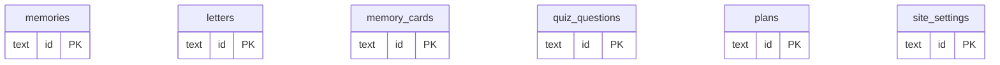

# DATABASE.md — Untukmu (Untuk Nona)

Status: SPECIFICATION. Skema ini adalah terjemahan dari `supabase/schema.sql` (Postgres) ke Cloudflare D1 (SQLite), dikelola lewat Drizzle ORM — pola yang sama seperti yang sudah pernah dikerjakan di project Alumni SYP-33-6.

Prinsip penerjemahan yang dipakai di seluruh dokumen ini:
- Postgres `ENUM` type → kolom `TEXT` dengan `CHECK` constraint (SQLite tidak punya tipe enum native).
- `gen_random_uuid()` (ekstensi `pgcrypto`) → UUID di-generate di application layer memakai `crypto.randomUUID()` (tersedia native di Workers runtime), lalu di-insert sebagai nilai literal.
- `timestamptz` → disimpan sebagai `TEXT` (format ISO 8601), karena SQLite tidak punya tipe timestamp native. Perbandingan tanggal dilakukan di application layer, bukan lewat fungsi tanggal SQL Postgres-spesifik.
- Kolom media (`image_url`, `cloudinary_public_id`) diganti dengan referensi R2 (`media_key`, `media_original_name`, `media_size_bytes`, `media_mime_type`) sesuai DEC-009.

Skema ini **belum menambahkan** kolom CMS lanjutan (featured/hero flag, theme per chapter, crop/position) sesuai DEC-006 — kolom tersebut didesain agar bisa ditambahkan lewat `ALTER TABLE ADD COLUMN` di migrasi terpisah nanti tanpa perlu mengubah struktur tabel yang sudah ada (lihat bagian 5, Migration considerations).

---

## 1. Entities

### memories

Dipakai bersama oleh chapter "Sebuah Awal" (Timeline) dan "Momen Kecil" (Gallery) — satu sumber data, dua presentasi, tidak berubah dari pola sekarang.

| Field | Type | Constraints | Notes |
|---|---|---|---|
| id | TEXT | PK | UUID, generate di app layer |
| title | TEXT | NOT NULL | |
| story | TEXT | NULL | |
| memory_date | TEXT | NULL | Format `YYYY-MM-DD` |
| category | TEXT | NOT NULL, DEFAULT 'Momen Kecil' | |
| media_key | TEXT | NULL | R2 object key, contoh: `originals/memories/{id}.jpg` |
| media_original_name | TEXT | NULL | Nama file asli, untuk keperluan admin/backup |
| media_size_bytes | INTEGER | NULL | |
| media_mime_type | TEXT | NULL | |
| status | TEXT | NOT NULL, DEFAULT 'draft', CHECK (status IN ('draft','active','hidden')) | Menggantikan enum `content_status` |
| is_favorite | INTEGER | NOT NULL, DEFAULT 0 | SQLite tidak punya boolean native, pakai 0/1 |
| created_at | TEXT | NOT NULL | ISO 8601, default diisi app layer saat insert |

- **Lifecycle:** dibuat/diedit/dihapus lewat admin CMS. Soft-delete tidak dipakai — hapus berarti hapus baris (sesuai perilaku sekarang, tidak diubah).
- **Ownership:** admin tunggal (Alex).
- **Relationships:** tidak ada foreign key ke tabel lain di fase ini.

### letters

| Field | Type | Constraints | Notes |
|---|---|---|---|
| id | TEXT | PK | UUID |
| title | TEXT | NOT NULL | |
| body | TEXT | NOT NULL | |
| unlock_label | TEXT | NULL | |
| status | TEXT | NOT NULL, DEFAULT 'draft', CHECK (status IN ('draft','active','hidden')) | |
| created_at | TEXT | NOT NULL | |

### memory_cards

| Field | Type | Constraints | Notes |
|---|---|---|---|
| id | TEXT | PK | UUID |
| title | TEXT | NOT NULL | |
| body | TEXT | NOT NULL | |
| card_type | TEXT | NOT NULL, DEFAULT 'Alasan' | |
| status | TEXT | NOT NULL, DEFAULT 'draft', CHECK (status IN ('draft','active','hidden')) | |
| sort_order | INTEGER | NOT NULL, DEFAULT 0 | |
| created_at | TEXT | NOT NULL | |

### quiz_questions

| Field | Type | Constraints | Notes |
|---|---|---|---|
| id | TEXT | PK | UUID |
| question | TEXT | NOT NULL | |
| option_a | TEXT | NOT NULL | |
| option_b | TEXT | NOT NULL | |
| option_c | TEXT | NOT NULL | |
| option_d | TEXT | NOT NULL | |
| correct_option | TEXT | NOT NULL, DEFAULT 'A', CHECK (correct_option IN ('A','B','C','D')) | |
| feedback | TEXT | NULL | |
| status | TEXT | NOT NULL, DEFAULT 'draft', CHECK (status IN ('draft','active','hidden')) | |
| sort_order | INTEGER | NOT NULL, DEFAULT 0 | |
| created_at | TEXT | NOT NULL | |

### plans

| Field | Type | Constraints | Notes |
|---|---|---|---|
| id | TEXT | PK | UUID |
| title | TEXT | NOT NULL | |
| note | TEXT | NULL | |
| plan_status | TEXT | NOT NULL, DEFAULT 'ingin_dilakukan', CHECK (plan_status IN ('ingin_dilakukan','direncanakan','tercapai')) | Menggantikan enum `plan_progress_status` |
| status | TEXT | NOT NULL, DEFAULT 'draft', CHECK (status IN ('draft','active','hidden')) | |
| sort_order | INTEGER | NOT NULL, DEFAULT 0 | |
| created_at | TEXT | NOT NULL | |

### site_settings

Single-row table, sama seperti sekarang (id selalu `'main'`).

| Field | Type | Constraints | Notes |
|---|---|---|---|
| id | TEXT | PK, DEFAULT 'main' | |
| birthday_message | TEXT | NULL | |
| final_message | TEXT | NULL | |
| music_url | TEXT | NULL | Fase awal: tetap URL eksternal atau R2 public URL untuk file audio. Tidak diproses lewat Image Transformations (itu khusus gambar). |
| updated_at | TEXT | NOT NULL | |

- **Lifecycle:** satu baris tetap (`id = 'main'`), di-update, tidak pernah di-insert baris kedua atau dihapus.
- **Ownership:** admin tunggal.
- **Relationships:** tidak ada.

---

## 2. Relationships

Tidak ada relasi foreign key antar tabel di skema ini — sesuai desain content model sekarang, setiap tabel berdiri independen dan hanya dikelompokkan secara logis lewat kode aplikasi (bukan constraint database).

---

## 3. Constraints & indexes

| Table | Constraint/Index | Reason |
|---|---|---|
| memories | CHECK (status IN (...)) | Menggantikan enum Postgres |
| memories | INDEX (status, memory_date) | Query publik selalu filter `status='active'` lalu sort `memory_date` — sesuai pola `publicContent.ts` sekarang |
| letters | CHECK (status IN (...)) | idem |
| letters | INDEX (status, created_at) | idem |
| memory_cards | CHECK (status IN (...)) | idem |
| memory_cards | INDEX (status, sort_order) | idem |
| quiz_questions | CHECK (correct_option IN ('A','B','C','D')) | idem |
| quiz_questions | INDEX (status, sort_order) | idem |
| plans | CHECK (plan_status IN (...)), CHECK (status IN (...)) | idem |
| plans | INDEX (status, sort_order) | idem |

Catatan: D1 punya batas storage 5 GB pada free tier dan model biaya berbasis rows read/written — indeks di atas penting justru karena tanpa indeks, query full-scan pada tabel kecil sekalipun tetap dihitung sebagai "rows read" penuh, bukan cuma soal kecepatan.

---

## 4. Seed data

Data awal (`Surat Ulang Tahun`, `Alasan kecil`, `Doa kecil`, pertanyaan quiz contoh, rencana contoh) dari `supabase/schema.sql` dipindahkan apa adanya ke migration seed D1, dengan `id` di-generate ulang lewat `crypto.randomUUID()` saat migrasi dijalankan (bukan hardcoded), dan `created_at` diisi waktu migrasi dijalankan.

---

## 5. Migration considerations

- **Kolom CMS lanjutan yang ditunda (DEC-006):** `is_featured` (INTEGER, default 0), `chapter_theme` (TEXT, nullable), `crop_x`/`crop_y`/`crop_zoom` (REAL, nullable) direncanakan sebagai migrasi tambahan terpisah di fase admin refinement (lihat TASKS.md Phase 10). Karena D1/SQLite mendukung `ALTER TABLE ADD COLUMN` dengan bebas untuk kolom nullable/berdefault, penambahan ini tidak memerlukan migrasi data yang merusak baris yang sudah ada.
- **Import data dari Supabase:** karena ini bukan sistem yang sudah punya banyak data produksi (masih tahap pengisian konten oleh admin), pendekatan migrasi data yang disarankan adalah export-import langsung (dump dari Supabase, transform ke insert statement D1) dibanding replikasi live — detail langkah ada di MIGRATION.md.
- **Media backfill:** setiap baris `memories` yang sudah punya `cloudinary_public_id` perlu diunduh dari Cloudinary lalu diunggah ulang ke R2 sebagai bagian dari migrasi data, dengan `media_key` baru menggantikan `cloudinary_public_id`. Ini task terpisah, dirinci di TASKS.md.
- **Drizzle ORM:** skema di atas ditulis sebagai Drizzle schema (`schema.ts`) mengikuti pola yang sudah dipakai di project Alumni SYP-33-6, bukan raw SQL migration manual, supaya konsisten dengan tooling yang sudah familiar.
