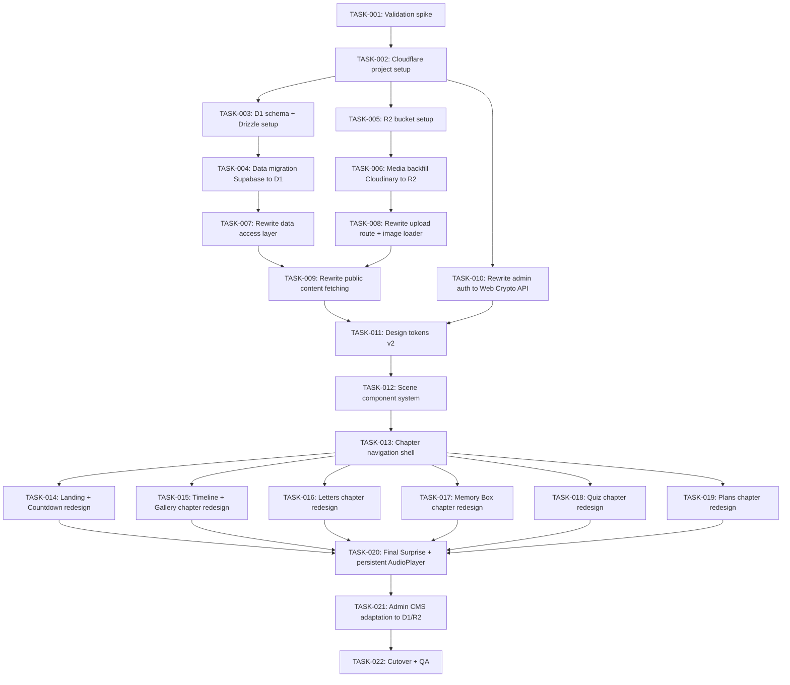

# TASKS.md — Untukmu (Untuk Nona)

Status: SPECIFICATION. Task breakdown ini untuk redesign visual/UX (DESIGN.md v2, termasuk revisi worldbuilding + scrollytelling di section 10–20) dan migrasi arsitektur (ARCHITECTURE.md, DATABASE.md, MIGRATION.md). Tidak ada kode yang ditulis di tahap ini — dokumen ini adalah rencana kerja untuk coding agent/developer selanjutnya.

Catatan urutan: Phase 0–4 (migrasi infrastruktur) dan Phase 5–11 (redesign visual/experience, termasuk Scene system) secara teknis independen satu sama lain, tapi disusun berurutan di sini sesuai MIGRATION.md section 3 (prinsip #4) untuk menghindari kerja ganda.

**Revisi kedua:** TASK-012 ditambahkan (Scene component system) sebagai fondasi wajib sebelum seluruh task redesign chapter (TASK-014 ke bawah), menggantikan pendekatan "styling per komponen lama" dengan sistem Scene reusable (DEC-013). Nomor task TASK-012 ke atas dari versi sebelumnya bergeser +2 — lihat dependency graph dan daftar task di bawah untuk urutan final.

---

## Dependency order



---

## Task list

### TASK-001: Validation spike — Next.js 16.2.7 di Cloudflare Workers via OpenNext

- **Priority:** P0
- **Description:** Buat project percobaan terpisah yang men-deploy skeleton fitur kunci (Route Handlers, `next/headers` cookies, Server Components async, security headers custom dari `next.config.mjs`, `next/image` dengan custom loader) ke Cloudflare Workers via `@opennextjs/cloudflare`.
- **Dependencies:** none
- **Related Decision:** DEC-008
- **Related Design:** ARCHITECTURE.md section 4.7; MIGRATION.md Phase 0
- **Implementation Scope:** Hanya skeleton/proof-of-concept. Tidak menyentuh kode production repo ini.
- **Acceptance Criteria:** Semua fitur di atas berfungsi tanpa downgrade Next.js atau workaround struktural besar (setara masalah middleware yang dialami di project Alumni SYP-33-6).
- **Testing Expectations:** Manual verification tiap fitur di deployment preview Cloudflare.
- **Status:** Not Started

### TASK-002: Cloudflare project & binding setup

- **Priority:** P0
- **Description:** Buat Cloudflare account/project untuk repo ini, definisikan Worker, siapkan konfigurasi binding (D1, R2) di `wrangler` config, pindahkan environment variables sesuai MIGRATION.md section 5.
- **Dependencies:** TASK-001
- **Related Design:** ARCHITECTURE.md section 4.6; MIGRATION.md Phase 1
- **Implementation Scope:** Konfigurasi infrastruktur saja, belum ada migrasi data/kode aplikasi.
- **Acceptance Criteria:** Worker kosong berhasil deploy dengan binding D1 dan R2 terpasang dan bisa diakses (baca/tulis test sederhana).
- **Testing Expectations:** Test binding lewat endpoint sementara/log, dihapus setelah verifikasi.
- **Status:** Not Started

### TASK-003: D1 schema + Drizzle ORM setup

- **Priority:** P0
- **Description:** Implementasikan skema di DATABASE.md sebagai Drizzle schema (`schema.ts`), jalankan migrasi ke D1 (`untukmu-db`).
- **Dependencies:** TASK-002
- **Related Design:** DATABASE.md section 1–3
- **Implementation Scope:** Skema tabel `memories`, `letters`, `memory_cards`, `quiz_questions`, `plans`, `site_settings` sesuai spesifikasi. Tidak termasuk kolom CMS lanjutan (DEC-006).
- **Acceptance Criteria:** Semua tabel, constraint, dan index di DATABASE.md berhasil dibuat di D1 dan bisa di-query lewat Drizzle client.
- **Testing Expectations:** Unit test insert/query dasar per tabel.
- **Status:** Not Started

### TASK-004: Migrasi data Supabase → D1

- **Priority:** P0
- **Description:** Export seluruh baris dari Supabase, transform sesuai aturan DATABASE.md (UUID re-generate, enum ke TEXT+CHECK, timestamp ke ISO string), insert ke D1 termasuk seed data.
- **Dependencies:** TASK-003
- **Related Design:** DATABASE.md section 4–5; MIGRATION.md Phase 2
- **Implementation Scope:** Transformasi dan migrasi data, tidak termasuk media (lihat TASK-006).
- **Acceptance Criteria:** Row count di D1 sama dengan Supabase per tabel; spot-check isi minimal 3 baris per tabel cocok dengan sumber.
- **Testing Expectations:** Script verifikasi row count otomatis + review manual sampel data.
- **Status:** Not Started

### TASK-005: R2 bucket setup

- **Priority:** P0
- **Description:** Buat R2 bucket (`untukmu-media`), definisikan struktur key (`originals/memories/{id}.{ext}`, dst sesuai jenis konten), pasang binding ke Worker.
- **Dependencies:** TASK-002
- **Related Design:** ARCHITECTURE.md section 4.3–4.4
- **Implementation Scope:** Infrastruktur storage saja.
- **Acceptance Criteria:** Worker bisa melakukan put/get object test ke bucket lewat binding.
- **Testing Expectations:** Test upload/download file dummy.
- **Status:** Not Started

### TASK-006: Backfill media Cloudinary → R2

- **Priority:** P0
- **Description:** Untuk setiap baris `memories` yang punya `cloudinary_public_id`, unduh file dari Cloudinary, unggah ke R2, catat `media_key` baru, update baris di D1.
- **Dependencies:** TASK-005, TASK-004
- **Related Design:** DATABASE.md section 5; MIGRATION.md Phase 3
- **Implementation Scope:** Migrasi file media yang sudah ada. Tidak termasuk upload baru dari admin (lihat TASK-008).
- **Acceptance Criteria:** Setiap foto lama bisa diakses dari R2 dengan `media_key` baru dan menghasilkan file identik (checksum/ukuran cocok) dengan sumber Cloudinary.
- **Testing Expectations:** Verifikasi checksum atau minimal ukuran file dan preview visual sampel foto.
- **Status:** Not Started

### TASK-007: Rewrite data access layer (`lib/db.ts`)

- **Priority:** P0
- **Description:** Ganti `lib/supabaseAdmin.ts` dengan client Drizzle berbasis binding D1.
- **Dependencies:** TASK-004
- **Related Design:** ARCHITECTURE.md section 4.1
- **Implementation Scope:** Layer akses data saja, belum termasuk perubahan pada `publicContent.ts`/`adminContent.ts` (lihat TASK-009).
- **Acceptance Criteria:** Semua fungsi query yang dipakai `publicContent.ts` dan admin API routes punya padanan di layer baru dengan interface yang sama atau setara.
- **Testing Expectations:** Unit test per fungsi query.
- **Status:** Not Started

### TASK-008: Rewrite upload route + image loader

- **Priority:** P0
- **Description:** Tulis ulang `app/api/admin/upload/route.ts` untuk upload ke R2. Implementasikan custom `next/image` loader yang mengarah ke Cloudflare Image Transformations dengan pola URL `/cdn-cgi/image/<params>/<r2-object-path>`.
- **Dependencies:** TASK-006
- **Related Design:** DESIGN.md v2 section 5 (Image component behavior); DEC-009
- **Implementation Scope:** Route upload dan loader gambar. Validasi tipe/ukuran file dipertahankan dari perilaku sekarang.
- **Acceptance Criteria:** Upload foto baru dari admin tersimpan di R2 dan bisa ditampilkan lewat `next/image` dengan variant ukuran sesuai breakpoint, tanpa pernah mengirim file original untuk kebutuhan thumbnail.
- **Testing Expectations:** Test upload end-to-end + verifikasi ukuran file yang benar-benar dikirim ke browser pada tiap breakpoint (lewat network inspector).
- **Status:** Not Started

### TASK-009: Rewrite public content fetching

- **Priority:** P0
- **Description:** Adaptasi `lib/publicContent.ts` (dan pemakainya) ke layer data baru (TASK-007) dan sumber media baru (TASK-008).
- **Dependencies:** TASK-007, TASK-008
- **Related Design:** ARCHITECTURE.md section 4.1
- **Implementation Scope:** Logic fetching, bukan tampilan (styling ditangani di Phase 5+).
- **Acceptance Criteria:** Seluruh halaman publik menampilkan data yang sama seperti sebelum migrasi, bersumber dari D1/R2.
- **Testing Expectations:** Regression check manual per halaman publik dengan data hasil migrasi.
- **Status:** Not Started

### TASK-010: Rewrite admin auth ke Web Crypto API

- **Priority:** P0
- **Description:** Tulis ulang `sign()`/`verifyAdminToken()`/`createAdminToken()` di `lib/adminAuth.ts` memakai `crypto.subtle`, pertahankan nama cookie, struktur payload, dan durasi sesi.
- **Dependencies:** TASK-002
- **Related Decision:** DEC-010
- **Implementation Scope:** Fungsi signing/verifikasi saja, tidak mengubah flow login/logout route.
- **Acceptance Criteria:** Login admin, verifikasi sesi, dan logout berfungsi identik dari sisi perilaku dibanding implementasi lama.
- **Testing Expectations:** Unit test sign/verify (termasuk kasus token invalid/expired), test manual flow login-logout.
- **Status:** Not Started

### TASK-011: Design tokens v2

- **Priority:** P1
- **Description:** Implementasikan ulang design tokens (`globals.css` — warna, tipografi, spacing, radius, shadow) sesuai DESIGN.md v2 section 9. Hapus/ganti kelas `.glass-card` dan `.sparkle` sesuai DEC-002/DEC-003.
- **Dependencies:** TASK-009, TASK-010
- **Related Design:** DESIGN.md v2 section 9
- **Implementation Scope:** Token dan utility class global. Tidak termasuk penerapan ke tiap komponen (itu tersebar di task Phase 6+).
- **Acceptance Criteria:** Kontras warna baru (burgundy/ivory) tervalidasi minimal WCAG AA untuk kombinasi teks/background yang dipakai.
- **Testing Expectations:** Automated contrast check (misalnya axe atau lighthouse) pada palet baru.
- **Status:** Not Started

### TASK-012: Scene component system (reusable)

- **Priority:** P1
- **Description:** Bangun komponen `<Scene>` reusable (background/midground/foreground/media/text/animation timeline/audio cue hook) sesuai DESIGN.md v2 section 11 dan 20, termasuk model interaksi scroll-progress (section 12) dan penerapan batas performa (section 19: maksimal 3 layer aktif per scene, lazy activation di luar viewport).
- **Dependencies:** TASK-011
- **Related Decision:** DEC-012, DEC-013, DEC-015
- **Related Design:** DESIGN.md v2 section 10–13, 15, 19, 20
- **Implementation Scope:** Sistem komponen Scene generik dan konfigurasinya lewat data/props. Tidak termasuk konten spesifik tiap chapter (itu di TASK-014 ke bawah).
- **Acceptance Criteria:** Satu instance `<Scene>` bisa dikonfigurasi lewat props untuk menghasilkan variasi tampilan berbeda tanpa mengubah kode komponen; animasi scene di luar viewport terbukti tidak berjalan (diverifikasi lewat profiler); `prefers-reduced-motion` menghasilkan versi tanpa parallax/scale yang tetap menampilkan seluruh konten.
- **Testing Expectations:** Unit test konfigurasi props Scene dengan beberapa varian; manual performance profiling (CPU/GPU) saat banyak Scene ada di DOM tapi hanya satu yang aktif di viewport; manual test dengan `prefers-reduced-motion` aktif.
- **Status:** Not Started

### TASK-013: Chapter navigation shell (Chapter Index Nav + World Frame transition)

- **Priority:** P1
- **Description:** Bangun komponen `<ChapterIndexNav>` (indeks unobtrusive 01–07) dan progress indicator sesuai DESIGN.md v2 section 16, plus efek transisi antar-chapter (crossfade + pergeseran World Frame) sesuai section 14. Ubah `/hub` dari grid menu menjadi intro chapter (tidak berubah dari keputusan sebelumnya, DEC-004).
- **Dependencies:** TASK-012
- **Related Decision:** DEC-004, DEC-014
- **Related Design:** DESIGN.md v2 section 2, 14, 16
- **Implementation Scope:** Shell navigasi dan transisi antar-chapter, bukan konten tiap chapter.
- **Acceptance Criteria:** Semua 7 chapter bisa diakses lewat indeks kapan saja pasca-unlock tanpa gate linear paksa; indeks tidak menutupi konten utama secara default (khususnya di mobile); transisi antar-chapter menampilkan crossfade + pergeseran World Frame, bukan hard-cut.
- **Testing Expectations:** Manual test navigasi antar-chapter dari indeks dan dari scroll linear; manual test di viewport mobile sempit untuk memastikan indeks tidak menutupi konten.
- **Status:** Not Started

### TASK-014: Redesign Landing + Countdown

- **Priority:** P1
- **Description:** Terapkan visual v2 ke Landing Page dan Countdown Page, termasuk copy hero sesuai contoh di PDF, World Frame sebagai elemen worldbuilding pembuka (DESIGN.md v2 section 10.2), hapus glassmorphism sebagai identitas utama, kurangi sparkle.
- **Dependencies:** TASK-013
- **Related Design:** DESIGN.md v2 section 4 (Flow), 9, 10
- **Implementation Scope:** Dua halaman ini saja.
- **Acceptance Criteria:** Birthday Mode trigger, confetti restrained, dan CTA ke Hub berfungsi sesuai flow di DESIGN.md v2 section 4.
- **Testing Expectations:** Manual test trigger unlock (simulasi waktu) dan tampilan responsif mobile/desktop.
- **Status:** Not Started

### TASK-015: Redesign Chapter Sebuah Awal (Timeline) + Momen Kecil (Gallery) sebagai multi-scene

- **Priority:** P1
- **Description:** Susun ulang Timeline dan Gallery sebagai rangkaian `<Scene>` (bukan komponen tunggal) sesuai DESIGN.md v2 section 13 (multi-scene, dikelompokkan secara kronologis/tematik), memakai data dari layer baru (TASK-009) dan komponen Scene (TASK-012).
- **Dependencies:** TASK-013
- **Related Design:** DESIGN.md v2 section 1, 11, 13
- **Implementation Scope:** Dua chapter ini saja.
- **Acceptance Criteria:** Nama publik yang tampil adalah "Sebuah Awal"/"Momen Kecil", bukan "Timeline"/"Gallery"; gambar memakai responsive image sesuai TASK-008; jumlah scene menyesuaikan jumlah data aktual (bukan hardcoded); mematuhi batas performa TASK-012.
- **Testing Expectations:** Manual test tampilan dengan data foto hasil migrasi, termasuk kasus jumlah foto sangat sedikit dan banyak.
- **Status:** Not Started

### TASK-016: Redesign Chapter Yang Aku Ingat (Letters) sebagai scene per surat

- **Priority:** P1
- **Description:** Terapkan pengalaman "actual letter" (amplop → buka surat) sebagai satu `<Scene>` per surat aktif, sesuai DESIGN.md v2 section 13.
- **Dependencies:** TASK-013
- **Related Design:** DESIGN.md v2 section 1, 13
- **Implementation Scope:** Chapter Letters saja.
- **Acceptance Criteria:** Interaksi buka surat berfungsi dengan `prefers-reduced-motion` fallback yang tetap usable; jumlah scene sama dengan jumlah surat berstatus aktif.
- **Testing Expectations:** Manual test dengan reduced-motion aktif dan nonaktif.
- **Status:** Not Started

### TASK-017: Redesign Chapter Yang Tak Terucap (Memory Box)

- **Priority:** P1
- **Description:** Terapkan kartu flip/tap-reveal di dalam struktur Scene (1–2 scene, dikelompokkan) sesuai DESIGN.md v2 section 13.
- **Dependencies:** TASK-013
- **Related Design:** DESIGN.md v2 section 1, 13
- **Implementation Scope:** Chapter Memory Box saja.
- **Acceptance Criteria:** Interaksi flip/reveal berfungsi di touch (mobile) dan klik (desktop).
- **Testing Expectations:** Manual test di kedua mode input.
- **Status:** Not Started

### TASK-018: Redesign Chapter Tentang Kamu (Quiz) sebagai scene per pertanyaan

- **Priority:** P1
- **Description:** Terapkan quiz sebagai satu `<Scene>` per pertanyaan, progress mengikuti posisi scroll, sesuai DESIGN.md v2 section 13.
- **Dependencies:** TASK-013
- **Related Design:** DESIGN.md v2 section 1, 13
- **Implementation Scope:** Chapter Quiz saja.
- **Acceptance Criteria:** Progress dan feedback tetap terasa personal, hasil quiz tetap masuk ke narasi (bukan skor generik).
- **Testing Expectations:** Manual test alur quiz penuh.
- **Status:** Not Started

### TASK-019: Redesign Chapter Mungkin Nanti (Plans)

- **Priority:** P1
- **Description:** Terapkan visual "future journal" untuk status rencana (ingin dilakukan/direncanakan/tercapai) dalam struktur Scene dikelompokkan per status, sesuai DESIGN.md v2 section 13.
- **Dependencies:** TASK-013
- **Related Design:** DESIGN.md v2 section 1, 13
- **Implementation Scope:** Chapter Plans saja.
- **Acceptance Criteria:** Ketiga status rencana punya representasi visual berbeda yang jelas, bukan task list generik.
- **Testing Expectations:** Manual test dengan data rencana di ketiga status.
- **Status:** Not Started

### TASK-020: Final Surprise + AudioPlayer persistent + audio cue

- **Priority:** P1
- **Description:** Redesign chapter Untuk Hari Ini sebagai puncak emosional (dark burgundy section, large whitespace, satu scene pacing lambat) dan pindahkan AudioPlayer ke level layout persisten sesuai DEC-007, ditambah opsi audio cue halus di scene transition sesuai DESIGN.md v2 section 17.
- **Dependencies:** TASK-014, TASK-015, TASK-016, TASK-017, TASK-018, TASK-019
- **Related Design:** DESIGN.md v2 section 13, 17 (AudioPlayer & audio cue); DEC-007
- **Implementation Scope:** Chapter Final Surprise + refactor posisi AudioPlayer di layout + implementasi audio cue opsional.
- **Acceptance Criteria:** State play/pause AudioPlayer tidak reset saat berpindah antar chapter mana pun (bukan cuma menuju Final); tidak pernah lebih dari satu audio cue aktif bersamaan; volume audio cue jelas lebih rendah dari musik utama.
- **Testing Expectations:** Manual test: mulai putar musik di Chapter 01, navigasi ke Chapter 07 lewat indeks, verifikasi musik tetap berjalan tanpa jeda/reset; manual test scene transition dengan audio cue aktif untuk memastikan tidak menumpuk.
- **Status:** Not Started

### TASK-021: Adaptasi Admin CMS ke D1/R2

- **Priority:** P1
- **Description:** Pastikan seluruh admin panel (CRUD Memories/Letters/Cards/Quiz/Plans, preview mode, health check) berfungsi penuh di atas layer data dan media baru.
- **Dependencies:** TASK-020
- **Related Decision:** DEC-006 (advanced fields tetap ditunda di task ini)
- **Implementation Scope:** Fungsionalitas admin yang sudah ada, dipindah ke backend baru. Tidak termasuk fitur featured/theme/crop baru.
- **Acceptance Criteria:** Semua operasi CRUD yang ada sekarang berfungsi identik di stack baru.
- **Testing Expectations:** Regression test manual seluruh alur admin.
- **Status:** Not Started

### TASK-022: Cutover & QA penuh

- **Priority:** P0
- **Description:** Arahkan domain ke Worker, jalankan smoke test production dengan data asli, mobile-first QA, accessibility check, performance check (termasuk validasi batas performa DEC-015 di kondisi jaringan lambat/throttled), lalu pantau sebelum menonaktifkan Vercel/Supabase/Cloudinary.
- **Dependencies:** TASK-021
- **Related Design:** MIGRATION.md Phase 11, section 6 (Rollback plan); DESIGN.md v2 section 19
- **Implementation Scope:** Verifikasi dan cutover, bukan fitur baru.
- **Acceptance Criteria:** Website berjalan penuh di Cloudflare dengan data asli, tidak ada regresi fungsional atau visual dibanding checklist DESIGN.md v2, initial load Chapter 01 tetap cepat pada simulasi koneksi lambat (network throttling), dan rollback plan tervalidasi bisa dijalankan bila diperlukan.
- **Testing Expectations:** Full manual QA pass (mobile + desktop), Lighthouse/accessibility audit, network throttling test untuk performa scrollytelling, review checklist guardrail PDF dan worldbuilding (content>decoration, one focal point per viewport, world frame konsisten, dst) sebagai bagian dari sign-off visual.
- **Status:** Not Started

---

## Handoff summary

```yaml
project:
  name: Untukmu (Untuk Nona)
  status: SPECIFICATION_COMPLETE
  complexity: small-medium (single-tenant, single-admin, moderate data + media pipeline + infra migration + reusable scrollytelling scene system)
  readiness: ready_for_implementation_planning

documents:
  - ARCHITECTURE.md
  - DATABASE.md
  - DESIGN.md (v2, revisi worldbuilding + scrollytelling)
  - DECISIONS.md
  - MIGRATION.md
  - TASKS.md

open_questions: []
assumptions:
  - "Deployment source tetap GitHub repository Alex4625/Untukmu (belum dikonfirmasi mekanisme CI/CD Cloudflare spesifik — Git integration vs GitHub Actions)"
confirmed_decisions:
  - "DEC-001 sampai DEC-015 (lihat DECISIONS.md)"
proposed_decisions: []
mvp_features: []
critical_dependencies:
  - "TASK-001 (validation spike) menggerbangi seluruh jalur migrasi infrastruktur"
  - "TASK-012 (Scene component system) menggerbangi seluruh task redesign chapter (TASK-014 ke bawah)"
known_risks:
  - "Kompatibilitas Next.js 16.2.7 dengan OpenNext belum terverifikasi untuk project spesifik ini"
  - "Perbedaan dialek SQL Postgres vs SQLite pada data eksisting"
  - "Sistem Scene scroll-driven berisiko menambah beban performa jika batas DEC-015 tidak dipatuhi ketat saat implementasi"
next_action: "Jalankan TASK-001 (validation spike) sebelum memulai implementasi task lain di jalur migrasi infrastruktur"
```
