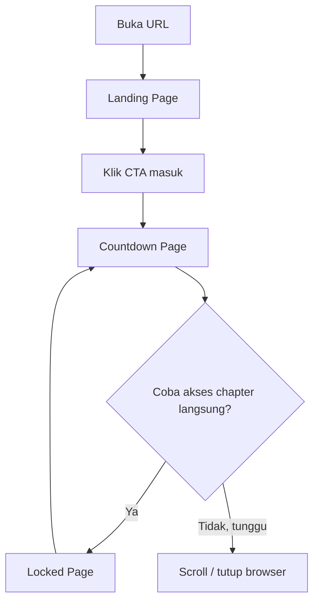
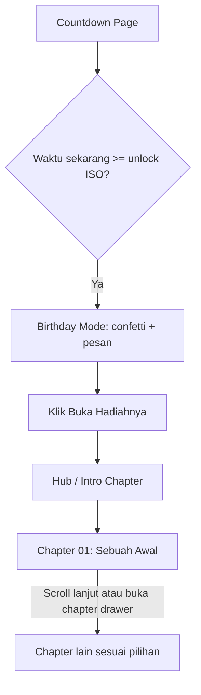

# DESIGN.md v2 — Untukmu (Untuk Nona)

Status: SPECIFICATION. Ini adalah revisi menyeluruh dari `docs/design.md` v1 (Juni 2026), menggabungkan requirement/content model dari repository (source of truth) dengan arah visual dari PDF "UNTUKMU Design Vision & Redesign Blueprint" (referensi visual/UX), plus keputusan desain yang sudah dikonfirmasi di percakapan ini. Dokumen ini menggantikan posisi `docs/design.md` sebagai acuan desain aktif — `design.md` v1 tetap disimpan sebagai riwayat, tidak dihapus.

**Revisi kedua (worldbuilding + scrollytelling direction):** section 10–20 di bawah adalah perluasan/revisi dari section 2 (Navigation), section 5 (Component behavior), dan section 9.6 (Motion) di atas — hasil integrasi dua reference eksternal: Stardew Valley (prinsip handcrafted world, environmental storytelling, tactile imperfection) dan SBS "The Boat" (prinsip scroll-driven storytelling, layered parallax, chapter progression). Kedua reference dipakai murni sebagai prinsip visual/interaksi — tidak ada artwork, asset, branding, atau layout yang disalin dari keduanya; Untukmu tetap memakai identitas visual sendiri dari section 9 (palet burgundy/ivory/sage/rose accent, tipografi Cormorant Garamond + DM Sans).

Filosofi inti tidak berubah dari v1: ini bukan landing page biasa, tapi hadiah digital yang terasa dibuat dengan tangan. Yang berubah adalah bagaimana filosofi itu diterjemahkan secara visual dan struktural.

---

## 1. Information architecture

Struktur konten tidak berubah dari content model repository — tujuh fitur yang sudah ada (Timeline, Gallery, Letters, Memory Box, Quiz, Plans, Final Surprise) dipertahankan penuh. Yang berubah adalah framing-nya: dari "kumpulan fitur yang bisa dipilih bebas" menjadi "chapter dari satu cerita", tanpa memaksa urutan linear (lihat bagian 3, Navigasi).

### Pemetaan chapter (nama teknis tetap dipakai di admin, nama publik berubah)

| # | Nama teknis (admin, kode) | Judul publik (chapter) | Konten yang ditampilkan |
|---|---|---|---|
| 01 | Timeline | Sebuah Awal | Kenangan kronologis dari tabel `memories`, ditampilkan sebagai timeline vertikal |
| 02 | Gallery | Momen Kecil | Kenangan yang sama dari tabel `memories`, ditampilkan sebagai koleksi foto asimetris |
| 03 | Letters | Yang Aku Ingat | Surat digital dari tabel `letters` |
| 04 | Memory Box | Yang Tak Terucap | Kartu kenangan dari tabel `memory_cards` |
| 05 | Quiz | Tentang Kamu | Pertanyaan dari tabel `quiz_questions` |
| 06 | Plans | Mungkin Nanti | Rencana dari tabel `plans` |
| 07 | Final Surprise | Untuk Hari Ini | Pesan akhir dari `site_settings.final_message` |

Prinsip: pengguna publik tidak pernah melihat kata "Timeline", "Gallery", dst di UI publik — semua label memakai judul chapter di atas. Admin panel tetap memakai nama teknis karena itu memudahkan Alex mengelola konten (tidak berubah dari kebiasaan sekarang).

---

## 2. Navigation

> Bentuk visual navigasi di bagian ini diperjelas/diperhalus di section 16 (indeks unobtrusive 01–07). Prinsip non-linear dengan shortcut di bawah ini tidak berubah.

**Pengalaman utama:** chapter-based scroll journey. Halaman `/hub` (yang di v1 adalah grid menu 7 kotak) diubah fungsinya menjadi **intro chapter** — layar pembuka yang mengarahkan ke Chapter 01, bukan lagi pusat pemilihan bebas.

**Navigasi sekunder (shortcut):** chapter drawer — panel navigasi ringan (bukan grid besar) yang bisa dibuka kapan saja untuk lompat langsung ke chapter tertentu. Ini menggantikan peran "grid menu" dari Hub v1, tapi statusnya jadi shortcut, bukan pengalaman utama.

**Urutan akses:** non-linear. Chapter ditampilkan berurutan secara naratif (01 sampai 07), tapi pengguna **tidak dipaksa** membuka chapter 1 dulu sebelum bisa ke chapter 3. Semua chapter yang sudah unlock (yaitu, sudah lewat tanggal 10 Desember 2026) bisa diakses kapan saja lewat chapter drawer. Ini beda dari kesan "harus baca buku dari halaman 1" — lebih ke "buku dengan daftar isi yang selalu bisa diakses".

**Progress indicator:** chapter counter kecil (misal "01 / 07") tetap ditampilkan sebagai bagian dari orientasi, bukan sebagai gate yang mengunci chapter berikutnya.

---

## 3. Screen / page inventory

| Screen | Route | Purpose | Primary role(s) |
|---|---|---|---|
| Landing | `/` | First impression, entry point | Publik |
| Countdown | `/countdown` | Menjaga antisipasi sebelum unlock, trigger Birthday Mode | Publik |
| Locked notice | `/locked` | Redirect saat akses chapter sebelum unlock | Publik |
| Hub (intro chapter) | `/hub` | Transisi dari unlock ke chapter journey, bukan lagi grid menu | Publik |
| Chapter 01 — Sebuah Awal | `/timeline` | Timeline kronologis | Publik |
| Chapter 02 — Momen Kecil | `/gallery` | Galeri foto asimetris | Publik |
| Chapter 03 — Yang Aku Ingat | `/letters` | Surat digital | Publik |
| Chapter 04 — Yang Tak Terucap | `/memory-box` | Kartu kenangan | Publik |
| Chapter 05 — Tentang Kamu | `/quiz` | Mini quiz | Publik |
| Chapter 06 — Mungkin Nanti | `/plans` | Rencana ke depan | Publik |
| Chapter 07 — Untuk Hari Ini | `/final` | Penutup emosional | Publik |
| Admin login | `/admin` | Autentikasi admin | Admin |
| Admin dashboard & CRUD | `/admin/*` | Kelola seluruh konten, upload, preview | Admin |

Route tidak berubah dari v1 — hanya presentasi dan framing publiknya yang berubah.

---

## 4. User flows

### Flow: Nona membuka website sebelum tanggal unlock



- **Trigger:** membuka URL sebelum 10 Desember 2026 00:00 WITA.
- **Steps:** Landing → Countdown → (opsional) mencoba akses chapter → Locked → kembali ke Countdown.
- **Success state:** pengguna memahami bahwa konten belum terbuka, tanpa merasa frustrasi (nada pesan tetap hangat, bukan pesan error teknis).
- **Failure states & recovery:** tidak ada failure state teknis di sini — semua adalah expected state.

### Flow: Unlock otomatis dan masuk ke chapter journey



- **Trigger:** waktu client mencapai `NEXT_PUBLIC_UNLOCK_ISO` saat pengguna berada di Countdown Page.
- **Steps:** Birthday Mode trigger → confetti reveal (restrained, sesuai DEC-002/DEC-003) → CTA → Hub/intro chapter → Chapter 01 → chapter berikutnya (linear secara naratif, tapi bisa lompat lewat drawer).
- **Success state:** pengguna sampai ke Chapter 07 (Untuk Hari Ini) kapan pun, dengan urutan bebas.
- **Failure states & recovery:** jika reload halaman di tengah chapter journey, state harus tetap konsisten — chapter journey tidak boleh reset ke Chapter 01 secara paksa (progress posisi chapter cukup disimpan di URL/route, tidak perlu server-side state tambahan).

### Flow: Admin mengelola konten

Tidak berubah signifikan dari v1 (Login → Dashboard → CRUD per jenis konten → Preview Mode). Diagram tidak diulang di sini karena flow-nya linear sederhana dan sudah terdokumentasi lengkap di README repository.

---

## 5. Component behavior

> Chapter Drawer dan AudioPlayer di bawah ini diperluas di section 16 (Navigation) dan section 17 (Audio Behavior). Komponen Image di bawah tetap berlaku penuh, ditambah lapisan reveal scroll-driven di section 12 dan 20 (Scene Architecture / Component Architecture).

### Chapter Drawer (baru)

- Trigger: tombol kecil persistent (posisi: pojok, tidak mengambang di tengah layar) yang bisa dibuka dari chapter mana pun setelah unlock.
- Isi: daftar 7 chapter dengan judul publik, indikator chapter yang sedang aktif, dan status (semua chapter selalu "terbuka" pasca-unlock — tidak ada locking antar-chapter).
- Perilaku: membuka drawer tidak menavigasi keluar dari state saat ini sampai pengguna memilih chapter tujuan.
- Ini menggantikan grid menu Hub v1 secara fungsi, tapi ukuran dan bobot visualnya jauh lebih ringan (bukan lagi full-page grid).

### AudioPlayer (redesign — persistent state)

- Kontrol play/pause manual, tidak ada autoplay default (tidak berubah dari prinsip PDF maupun v1).
- **Perubahan utama:** state play/pause harus bertahan saat pengguna berpindah antar chapter/halaman. Ini berarti `AudioPlayer` perlu dipindah ke level layout yang persisten di seluruh chapter journey (misalnya root layout untuk grup route publik pasca-unlock), bukan diinisialisasi ulang per halaman seperti kemungkinan sekarang.
- Elemen audio (`<audio>` tag) tidak boleh unmount saat pindah chapter — navigasi antar-chapter harus tetap mempertahankan instance yang sama.

### Image (Gallery, Timeline, Letters — semua tempat yang menampilkan foto)

- Selalu memakai `next/image` dengan custom loader yang mengarah ke Cloudflare Image Transformations (bukan mengirim R2 original langsung).
- Ukuran yang diminta harus disesuaikan slot tampilan (thumbnail grid, gallery card, hero besar) — tidak pernah meminta ukuran "large/original" untuk slot thumbnail kecil.
- `loading="lazy"` untuk semua gambar di luar viewport awal; gambar hero/first-impression tetap eager-load supaya tidak ada delay first impression.
- `sizes` attribute wajib diisi sesuai breakpoint (pola ini sudah ada di `MemoryGrid.tsx`/`Timeline.tsx` sekarang — dipertahankan, hanya sumber URL-nya yang berubah dari Cloudinary ke Cloudflare Image Transformations).

---

## 6. States to account for per relevant screen

- **Loading:** skeleton/placeholder halus (bukan spinner besar) untuk chapter yang sedang fetch data dari D1.
- **Empty:** dipertahankan dari v1 — pesan hangat, bukan pesan error teknis (contoh v1: "Belum ada foto yang ditambahkan").
- **Error:** jika D1/R2 gagal, chapter menampilkan pesan lembut yang tidak membocorkan detail teknis ke pengguna publik (khususnya Nona), sementara admin panel boleh menampilkan detail error yang lebih teknis untuk debugging.
- **Success (admin):** toast notification, pola dari v1 dipertahankan.
- **Destructive-action confirmation:** dipertahankan dari v1 (hapus konten di admin butuh konfirmasi/opsi undo).

---

## 7. Responsiveness

Mobile-first tetap wajib, bahkan lebih ditekankan di v2 — Nona kemungkinan besar membuka website ini dari smartphone. Aturan dari PDF diadopsi:

| Breakpoint | Perilaku |
|---|---|
| Mobile | Hero full-screen, alur vertikal, touch target besar, chapter drawer sebagai floating button/compact pill (bukan bottom navigation ala aplikasi) |
| Tablet | Mulai melebarkan type scale dan grid, tetap mempertahankan ritme cinematic (tidak buru-buru) |
| Desktop | Layout asimetris, tipografi besar, ruang napas lebih banyak — tapi hierarki konten harus sama dengan mobile, hanya komposisi yang berbeda |

---

## 8. Accessibility

- `prefers-reduced-motion` wajib dihormati — semua transisi/animasi harus punya fallback tanpa motion yang tetap fungsional (bukan sekadar dipercepat).
- Kontras warna: karena palet v2 bergeser ke burgundy/ivory yang lebih gelap dari rose/cream v1, kontras teks terhadap background wajib divalidasi ulang (minimal WCAG AA) — ini tidak otomatis terjamin hanya karena warna terlihat elegan.
- Touch target minimum 44px (dipertahankan dari v1).
- Semua gambar wajib punya `alt` text bermakna (bukan nama file), diisi dari field admin yang sudah ada (`title` pada `memories`).

---

## 9. Visual direction

### 9.1 Arah warna (DEC-001, DEC-002, DEC-003)

Basis utama mengikuti PDF (warm editorial, burgundy/ivory/sage), dengan aksen rose/pink dari identitas v1 dipertahankan sebagai *secondary accent*, bukan warna dominan.

| Role | Warna | Sumber |
|---|---|---|
| Base | `#F7F2EA` | PDF |
| Paper / surface section | `#EEE6DB` | PDF |
| Ink (body text) | `#272322` | PDF |
| Heading / dark section | `#5A2834` (burgundy) | PDF |
| Primary accent / interaksi | `#B47F84` (dusty rose) | PDF |
| Secondary accent (identitas "Untukmu") | Rose dari v1, versi lebih redup — disarankan `#B94F68` dipakai terbatas (misal micro-interaction, hover state kecil), bukan warna CTA dominan | v1, diredupkan sesuai DEC-001 |
| Secondary accent (alam) | `#8F9983` (sage) | PDF |
| Highlight sangat halus | `#B39A6B` (gold) | PDF |

Aturan: warna burgundy/ivory/sage jadi identitas dominan di seluruh chapter journey. Rose accent dari v1 muncul di tempat-tempat kecil dan sengaja (misalnya warna hover tombol sekunder, aksen kecil di chapter tertentu) supaya karakter "Untukmu" tidak hilang total, tapi tidak boleh kembali dominan seperti v1.

### 9.2 Glassmorphism (DEC-002)

Bukan lagi design language utama. Dilarang dipakai sebagai identitas section (berbeda dari v1 section 5.6 yang mewajibkannya di Landing/Countdown/Final). Translucency ringan hanya boleh dipakai kalau memang mendukung komposisi spesifik (misalnya overlay tipis di atas foto hero untuk keterbacaan teks) — bukan sebagai kartu glass yang jadi ciri khas halaman.

### 9.3 Sparkle & confetti (DEC-003)

Sparkle tidak lagi jadi dekorasi global/persistent di background (berbeda dari `.sparkle` di v1 yang tampil di banyak halaman). Confetti hanya muncul sekali, di reveal Chapter 07 (Untuk Hari Ini) atau saat Birthday Mode trigger di Countdown — dengan durasi terbatas dan tidak berulang.

### 9.4 Tipografi

Tidak berubah dari v1 — Cormorant Garamond untuk heading/emosi, DM Sans untuk UI/body. Skala tipografi dari v1 section 5.2 tetap berlaku sebagai baseline, kecuali ada penyesuaian yang muncul saat implementasi visual detail (ditandai TBD jika terjadi).

### 9.5 Spacing, radius, shadow

Skala dari v1 (section 5.3–5.5) dipertahankan sebagai baseline teknis (base unit 4px, radius scale, shadow scale) — PDF tidak memberikan angka spesifik di area ini, jadi tidak ada konflik yang perlu diputuskan. Prinsip guardrail PDF ("whitespace > filling space", "one focal point per viewport") diterapkan di atas skala teknis yang sudah ada, bukan menggantikannya.

### 9.6 Motion

Purposeful, subtle, accessible (prinsip PDF diadopsi penuh, tidak ada konflik dengan v1). Page transition crossfade/slide singkat (400–700ms). Motion yang tidak memberi fungsi atau emosi dihapus, bukan dipertahankan "karena sudah ada".

> Prinsip ini diperluas signifikan di section 15 untuk konteks scroll-driven motion (worldbuilding + scrollytelling direction). Section 9.6 tetap berlaku sebagai baseline untuk motion non-scroll (page transition, micro-interaction UI biasa).

---

## 10. Worldbuilding & visual language 2.0

Bagian ini mengintegrasikan dua design reference eksternal ke dalam identitas Untukmu, murni di level prinsip — bukan meniru artwork, asset, branding, atau layout dari keduanya.

### 10.1 Dari Stardew Valley — prinsip yang diambil (bukan aset)

- **Handcrafted feel, bukan pixel art.** Yang diambil bukan gaya visual game (pixel art, sprite), melainkan *rasa* bahwa dunia ini dibuat dengan tangan untuk satu orang — ini sudah selaras dengan prinsip "human imperfection > sterile perfection" dari PDF v1 (DESIGN.md v2 mengadopsinya lewat tekstur kertas, sedikit offset/rotation pada elemen, yang sudah tercatat di v1 section terkait Memory Box).
- **Environmental storytelling.** Detail kecil di sekitar konten utama (motif ilustrasi halus, tekstur, elemen dekoratif kecil yang konsisten) memperkuat suasana chapter, tapi tidak boleh mengganggu fokus pada foto/tulisan (tetap tunduk pada guardrail "content > decoration" dari PDF, tidak berubah).
- **Dunia, bukan kumpulan UI.** Tiap chapter dirasakan sebagai "tempat" yang punya karakter sendiri dalam satu dunia yang sama — dicapai lewat konsep *World Frame* (10.2), bukan lewat tema visual yang benar-benar berbeda per chapter (itu akan merusak DEC-001, konsistensi identitas).

### 10.2 World Frame — elemen worldbuilding original untuk Untukmu

- Motif visual berulang lintas seluruh chapter, berfungsi sebagai penanda "kamu masih berada di dunia kecil yang sama": tekstur kertas hangat (sudah ada di palet v1), elemen ilustrasi kecil dan konsisten (misalnya motif garis tangan/hand-drawn di sudut scene, bukan foto/ilustrasi bertema game), dipakai secukupnya — tunduk pada DEC-002/DEC-003 (no visual overload).
- Tiap chapter adalah "tempat kecil" berbeda dalam dunia yang sama: atmosfer background boleh bergeser pelan sesuai suasana chapter (contoh: "Untuk Hari Ini" terasa lebih intim/dalam dibanding "Momen Kecil" yang lebih terang), tapi tetap dalam satu keluarga palet section 9.1 — tidak ada palet baru per chapter.

### 10.3 Dari The Boat — prinsip yang diambil (bukan aset)

- **Scroll sebagai mekanisme narasi**, bukan sekadar cara berpindah dari satu blok konten ke blok lain.
- **Foto/konten sebagai pemeran utama scene penuh** (full-bleed), bukan dibingkai jadi card kecil di tengah halaman kosong — ini memperkuat guardrail "one focal point per viewport" yang sudah ada di PDF v1.
- **Layered depth** (background/midground/foreground) untuk memberi kesan kedalaman tanpa harus jadi ilustrasi kompleks — detail teknisnya di section 11.
- **Pacing cinematic-emosional**, terutama di chapter penutup — sejalan dengan arahan "Final Surprise paling tenang" yang sudah ada sejak PDF v1.

### 10.4 Gabungan arah visual final

```
Handcrafted illustrated world (prinsip, bukan gaya pixel-art)
+ Warm romantic storytelling (identitas Untukmu, section 9.1)
+ Digital scrapbook (seasoning, bukan tema dominan — prinsip PDF v1 tidak berubah)
+ Editorial typography (Cormorant Garamond + DM Sans, tidak berubah)
+ Cinematic scrollytelling (section 11–15)
```

### 10.5 Layout — strict invisible grid

Seluruh Scene (section 11) disusun di atas grid tak terlihat yang konsisten untuk menjaga alignment, spacing, tipografi, proporsi, dan hierarki visual. Asimetri visual boleh dan disarankan untuk kesan handcrafted (foto dengan ukuran/posisi berbeda, teks yang tidak selalu center), tapi **setiap elemen tetap harus align terhadap grid** — asimetri yang disengaja dan terkontrol, bukan penempatan bebas/acak. Prinsip yang dipegang: *handcrafted, tetapi sangat terkontrol* — grid spesifik (jumlah kolom, breakpoint) adalah keputusan implementasi visual, bukan diputuskan di level spesifikasi ini.

---

## 11. Scene architecture (reusable component system)

Untuk menjawab kebutuhan "jangan membuat setiap chapter dengan sistem animasi yang sepenuhnya berbeda", seluruh chapter journey dibangun di atas satu struktur reusable bernama **Scene**:

```
Scene
├── background     — warna dasar/tekstur/atmosfer chapter, bergerak paling lambat saat scroll
├── midground       — elemen ilustrasi pendukung suasana (opsional, boleh kosong di scene sederhana), bergerak medium
├── foreground/media — foto/konten utama (fokus pembaca), bergerak paling sedikit atau statis
├── text           — narasi/caption terkait scene, reveal terkontrol (section 12)
├── animation timeline — definisi keyframe berbasis scroll-progress untuk tiap layer di atas
└── audio cue (opsional) — trigger suara/ambience halus saat scene ini aktif (section 17)
```

**Prinsip reusability:** satu definisi komponen Scene dipakai di seluruh 7 chapter, dikonfigurasi lewat data/props — bukan ditulis ulang per chapter. Variasi antar chapter dicapai lewat konten dan parameter (warna atmosfer, jumlah layer aktif, jenis transisi), bukan lewat sistem animasi yang berbeda-beda. Detail struktur komponen konkret ada di section 20.

Satu chapter terdiri dari satu atau beberapa Scene tersusun berurutan (section 13).

---

## 12. Scroll interaction model

Model umum, berlaku di semua Scene:

```
scroll progress (0 → 1, relatif terhadap tinggi scene aktif)
  ↓
background        : translateY halus, parallax lambat, magnitude kecil
midground          : translateY sedang + fade in/out di batas scene
foreground/media   : scale halus (mis. 1.0 → 1.03) dan/atau translateY minimal — tetap jadi fokus, tidak "ikut terbang"
text               : reveal bertahap (staggered), terikat threshold progress tertentu (mis. muncul di progress 0.2, selesai di 0.5)
scene transition   : crossfade/reveal di sekitar batas antar scene (progress mendekati 0 atau 1)
audio cue          : trigger sekali saat progress melewati threshold tertentu, tidak berulang tiap scroll
```

Ini sengaja berbeda dari pola "reveal saat elemen masuk viewport" yang dipakai PDF v1 — pergerakan di sini terikat pada *seberapa jauh* scroll di dalam scene, bukan sekadar *apakah* elemen sudah terlihat.

Prinsip implementasi (bukan keputusan kode final, sebagai batas performa wajib — lihat section 19): deteksi scene aktif sebaiknya berbasis Intersection Observer, pergerakan visual berbasis CSS transform, bukan penghitungan ulang seluruh elemen di setiap event scroll.

---

## 13. Chapter experience structure

Tiap chapter (01–07) disusun sebagai rangkaian Scene, jumlahnya menyesuaikan kepadatan konten aktual (data dari admin), bukan angka tetap yang di-hardcode:

| Chapter | Perkiraan jumlah scene | Catatan |
|---|---|---|
| 01 — Sebuah Awal (Timeline) | Multi-scene: 1 scene intro + 1 scene per kelompok kronologis kenangan | Selaras sifat timeline yang berurutan |
| 02 — Momen Kecil (Gallery) | Multi-scene, foto dikelompokkan | Foto terasa "ditemukan" satu-satu, bukan grid statis panjang |
| 03 — Yang Aku Ingat (Letters) | 1 scene per surat aktif | Selaras pengalaman "amplop dibuka" (section 1, DESIGN.md v2 awal) |
| 04 — Yang Tak Terucap (Memory Box) | 1–2 scene, interaksi flip di dalam scene | |
| 05 — Tentang Kamu (Quiz) | 1 scene per pertanyaan | Progress quiz selaras posisi scroll |
| 06 — Mungkin Nanti (Plans) | 1–2 scene, dikelompokkan per status (ingin dilakukan/direncanakan/tercapai) | |
| 07 — Untuk Hari Ini (Final Surprise) | 1 scene tunggal, pacing paling lambat | Puncak emosional, tidak terburu-buru |

---

## 14. Scene transition model

**Antar-scene dalam satu chapter:** menyatu dengan scroll (bagian dari section 12) — tidak ada tombol "lanjut" terpisah, murni discroll.

**Antar-chapter** (misalnya user lompat dari Chapter 02 ke Chapter 05 lewat navigasi, section 16): crossfade singkat 400–700ms (konsisten dengan durasi motion di section 9.6), disertai pergeseran World Frame (section 10.2) untuk memberi kesan berpindah "tempat" dalam dunia yang sama — bukan berpindah ke halaman lain yang tidak berhubungan.

---

## 15. Motion principles (revisi & perluasan section 9.6)

- Smooth, cinematic, intentional — setiap motion punya alasan naratif/fungsional, tidak ada yang murni dekoratif.
- Motion terikat scroll progress untuk elemen yang menerjemahkan cerita (section 12), bukan animasi berbasis timer yang berjalan sendiri lepas dari tindakan pembaca.
- **Dilarang secara eksplisit:** random floating effect, sparkle berlebihan (menegaskan kembali DEC-003), bounce berlebihan, parallax berlebihan (batas magnitude konkret ada di section 19), motion yang murni dekoratif tanpa fungsi naratif.
- `prefers-reduced-motion`: seluruh scroll-linked motion (parallax, scale, staggered text reveal) diganti transisi opacity sederhana atau instant state change — konten tetap 100% dapat diakses tanpa kehilangan informasi.

---

## 16. Navigation (revisi & perluasan section 2 dan Chapter Drawer di section 5)

Prinsip inti dari DEC-004 tidak berubah: chapter naratif berurutan, tapi akses tetap non-linear lewat shortcut. Yang berubah adalah bentuk visualnya, menjadi lebih unobtrusive (DEC-014):

- **Bentuk:** indeks angka kecil persistent (01–07) di tepi viewport — bukan drawer besar yang menutupi layar. Highlight otomatis mengikuti chapter/scene yang sedang aktif.
- **Interaksi:** klik/tap salah satu angka langsung membawa ke chapter tersebut lewat crossfade transition (section 14), tanpa membuka panel besar dulu.
- **Mobile:** bentuk paling ringkas (mis. dot/angka kecil di tepi, expandable saat disentuh). Prinsip wajib: navigasi tidak boleh menutupi konten utama secara default.

---

## 17. Audio behavior (revisi & perluasan DEC-007)

- AudioPlayer utama ("Our Song") tetap persistent lintas chapter sesuai DEC-007 — tidak berubah.
- Scene transition **boleh** memiliki audio cue halus tambahan — lapisan tipis di atas musik utama, bukan menggantikannya. Opsional per chapter, tidak wajib ada di semua scene.
- **Batasan tegas:** maksimal satu audio cue aktif dalam satu waktu (tidak menumpuk beberapa suara sekaligus), volume audio cue jauh lebih rendah dari musik utama, tidak dipaksakan di tiap scene hanya demi kelengkapan. Tujuannya tetap suasana hangat-intim, bukan kesan horror game atau multimedia overload.

---

## 18. Mobile adaptation

- Midground layer (layer dekoratif tambahan, section 11) disederhanakan jadi statis atau dihilangkan di breakpoint mobile secara default — pendekatan "konsisten ringan" dipilih dibanding deteksi kapabilitas device yang rumit.
- Magnitude parallax dan scale dikurangi signifikan dibanding desktop (bukan dihilangkan total, kecuali `prefers-reduced-motion` aktif).
- Auto-scroll (jika diimplementasikan sama sekali) tidak pernah default aktif di perangkat apa pun — harus opt-in eksplisit lewat tombol, terutama penting di mobile karena kontrol scroll yang lebih sensitif terhadap gerakan otomatis.

---

## 19. Performance constraints

Wajib dipatuhi karena target pengguna (Nona) bisa berada di koneksi/perangkat yang tidak selalu prima:

- Scene di luar viewport (plus buffer kecil di sekitarnya) tidak menjalankan animasi aktif — lazy activation, bukan sekadar lazy loading.
- Maksimal 3 layer bergerak aktif bersamaan per scene (background, midground, foreground/media) — tidak ada layer animasi tambahan di atas ini.
- Pipeline gambar tetap mengikuti ARCHITECTURE.md/DEC-009 (Cloudflare Image Transformations, responsive sizing, lazy loading) — scrollytelling menambah efek reveal halus saat scene aktif, tapi ukuran file yang di-load tetap sesuai viewport, tidak pernah ukuran besar yang di-crop secara visual saja.
- Initial load (Chapter 01 / scene pertama) diprioritaskan; aset chapter lain dimuat progresif seiring user mendekati chapter tersebut (scroll atau navigasi), tidak semua chapter dimuat sekaligus di awal.
- Audio cue (section 17) memakai file pendek/ringan, di-preload minimal — audio cue chapter lain tidak ikut ter-load di awal.

---

## 20. Component architecture

Struktur komponen indikatif untuk perencanaan (nama final adalah keputusan implementasi):

```
<ChapterJourney>                 // shell utama: chapter aktif + state global (termasuk AudioPlayer persistent, DEC-007)
  <ChapterIndexNav />            // navigasi unobtrusive 01-07 (section 16)
  <PersistentAudioPlayer />      // dipindah ke level shell, DEC-007
  <Chapter chapterId="...">
    <Scene sceneId="...">
      <SceneBackground />
      <SceneMidground />         // opsional
      <SceneMedia />             // foto/konten utama, memakai image loader DEC-009
      <SceneText />              // reveal bertahap, section 12
      // animation timeline: konfigurasi data, bukan komponen terpisah
    </Scene>
    <!-- Scene berulang sesuai jumlah scene chapter, section 13 -->
  </Chapter>
</ChapterJourney>
```

**Prinsip:** `<Scene>` adalah satu komponen reusable dipakai di seluruh chapter, dikonfigurasi lewat props/data — bukan diturunkan jadi komponen berbeda per chapter. Konten spesifik tiap chapter (foto Timeline, teks surat, pertanyaan quiz, dst) masuk sebagai data yang dirender lewat slot `SceneMedia`/`SceneText`, bukan lewat percabangan komponen. Ini konsisten dengan DEC-013 dan menjawab langsung permintaan "jangan membuat setiap chapter dengan sistem animasi yang sepenuhnya berbeda".
